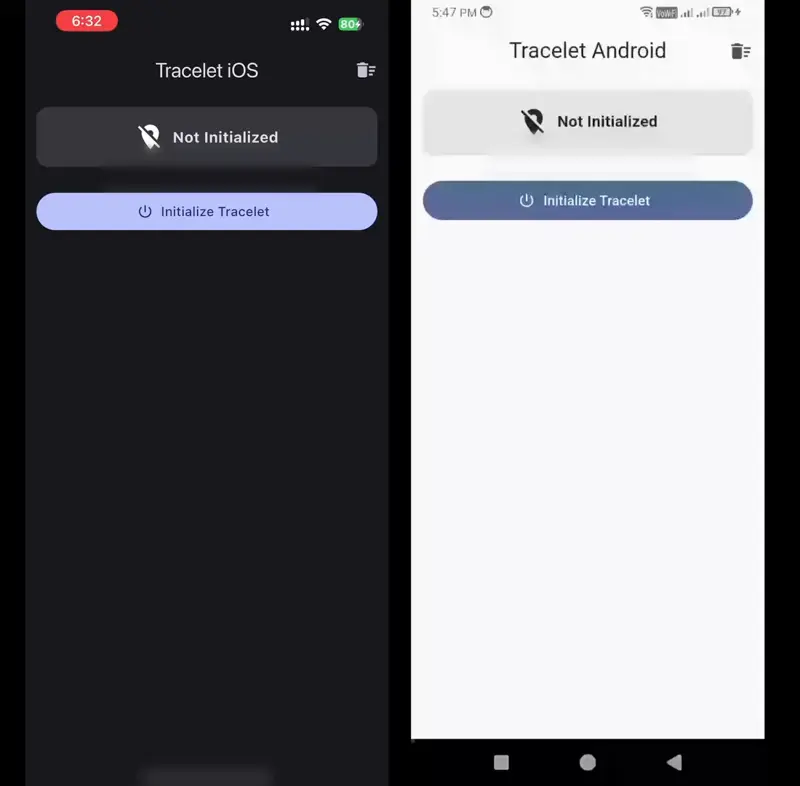
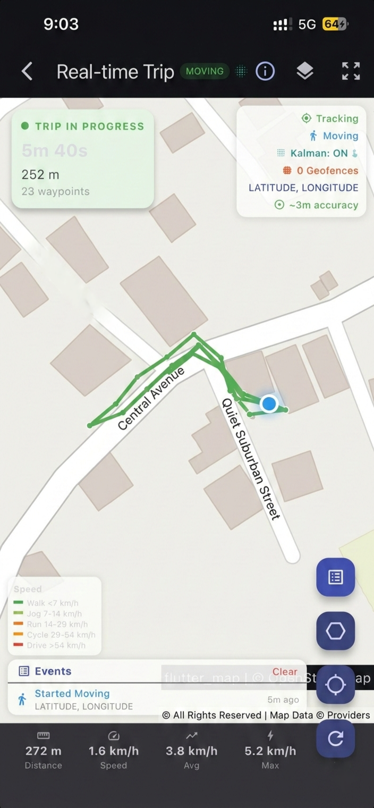

<p align="center">
  
</p>

# Tracelet

<p align="center">
  
</p>

<p align="center">
  
</p>

[](https://opensource.org/licenses/Apache-2.0)
[](https://github.com/Ikolvi/Tracelet/actions)

> **Production-grade background geolocation for Flutter — fully open-source.**

Battery-conscious motion-detection intelligence, geofencing, SQLite persistence, HTTP sync, and headless Dart execution for iOS & Android.

## Features

- **Motion-detection intelligence** — Uses accelerometer, gyroscope & activity recognition to detect when the device is moving or stationary. Automatically toggles location services to conserve battery.
- **Background location tracking** — Continuous GPS recording with configurable `distanceFilter` and `desiredAccuracy`. Works after app is minimized, killed, or device rebooted.
- **Geofencing** — Add circular or polygon geofences with enter/exit/dwell detection. **Unlimited geofences** via proximity-based auto-load/unload — only the closest geofences within `geofenceProximityRadius` are registered with the OS (up to 100 on Android, 20 on iOS), enabling monitoring of thousands of geofences despite platform limits.
- **SQLite persistence** — All locations stored locally in SQLite. Query, count, delete, or sync to your server. Configurable retention (max days/records) and per-type persistence modes.
- **HTTP auto-sync** — Configurable batch upload with retry, exponential backoff, and offline queuing. Wi-Fi-only sync option via `disableAutoSyncOnCellular`. Configurable `maxRetries`, `retryBackoffBase`, and `retryBackoffCap` for fine-tuned retry strategy. Connectivity-aware deferred sync on both platforms.
- **Adaptive sampling** — Automatically adjusts `distanceFilter` based on detected activity (walking, driving, still), battery level, and speed. Reduces GPS polling when stationary or battery-low, increases resolution when driving. Enable with `enableAdaptiveMode: true`.
- **Health check API** — Single-call `getHealth()` returns a comprehensive diagnostic snapshot: tracking state, permissions, battery, OEM health, sensors, database stats, and auto-detected warnings. Build monitoring dashboards or pre-flight checks with zero boilerplate.
- **Headless execution** — Run Dart code in response to background events even when the Flutter UI is not running.
- **Start on boot** — Resume tracking automatically after device reboot.
- **Scheduling** — Define time-based schedules (e.g., "Mon–Fri 9AM–5PM"). Use `scheduleUseAlarmManager` on Android for exact-time execution.
- **Comprehensive logging** — SQLite-backed log system with email export.
- **Debug sounds** — Audible feedback during development for location, motion, geofence, and HTTP events.
- **Elasticity control** — Speed-based automatic distance filter scaling, with `disableElasticity` and `elasticityMultiplier` overrides.
- **Location filtering** — Reject GPS spikes and low-accuracy readings with `LocationFilter` (accuracy thresholds, max implied speed, odometer filtering).
- **Kalman filter GPS smoothing** — Optional Extended Kalman Filter smooths GPS coordinates in real-time, eliminating jitter and producing cleaner tracks. Enable with `useKalmanFilter: true` in `LocationFilter`.
- **Trip detection** — Automatic trip start/stop events based on motion state transitions. Each trip includes distance, duration, start/stop location, and all waypoints. Subscribe via `onTrip()`.
- **Polygon geofences** — Define geofences with arbitrary polygon vertices using ray-casting point-in-polygon containment checks. Set `vertices` on a `Geofence` instead of using a circular radius.
- **Auto-stop** — Automatically stop tracking after a configurable number of minutes via `stopAfterElapsedMinutes`.
- **Configurable motion sensitivity** — Tune accelerometer thresholds (`shakeThreshold`, `stillThreshold`, `stillSampleCount`) from Dart. Use built-in presets (Low / Medium / High) or set custom values. iOS auto-converts m/s² to g-force.
- **Activity recognition tuning** — Adjust confidence thresholds, stop-detection delays, and stationary behavior.
- **Timestamp metadata** — Optional extra timing fields on each location record via `enableTimestampMeta`.
- **Geofence high-accuracy mode** — Run the full GPS + motion pipeline in geofence-only mode (Android) via `geofenceModeHighAccuracy`.
- **Prevent suspend (iOS)** — Silent audio keep-alive to prevent iOS from suspending the app in the background.
- **iOS background task protection** — All critical native operations (location persist, HTTP sync, headless engine boot, lifecycle transitions) wrapped in `beginBackgroundTask` for safe background execution.
- **iOS 17+ / 18+ session APIs** — `CLBackgroundActivitySession` (iOS 17+) and `CLServiceSession` (iOS 18+) for extended background runtime and authorization state.
- **Dart-controlled permissions** — No native dialogs. Full Dart-side customization of permission UI, translations, and behavior.
- **Foreground service toggle** — Run with or without a persistent notification (Android).
- **Shared Dart algorithms** — Location filtering (elasticity, accuracy, speed), geofence proximity evaluation, schedule parsing, and persistence logic all run in shared Dart code for cross-platform consistency. Write once — works on Android, iOS, web, and future desktop platforms.
- **Battery budget engine** — Automatic feedback control loop adjusts `distanceFilter`, `desiredAccuracy`, and periodic interval to stay within a configurable battery drain budget (`batteryBudgetPerHour`, typical 1.0–5.0 %/hr). Subscribe to real-time adjustment events via `onBudgetAdjustment()`.
- **Carbon footprint estimator** — Per-trip and cumulative CO₂ emission calculator using EU EEA 2024 mode-specific factors (gCO₂/km): car = 192, bus = 89, train = 41, walking/cycling = 0. Integrates with activity recognition to track distance per transport mode.
- **Delta encoding** — Batch location compression codec achieving 60–80% payload reduction for HTTP sync. First location transmitted in full; subsequent positions as deltas with shortened field names. Triple implementation (Dart + Kotlin + Swift) for native encoding.
- **R-tree spatial index** — O(log n) geofence proximity queries supporting 10,000+ geofences with sub-millisecond lookup. `queryCircle()` and `queryBBox()` APIs with Haversine-verified results.
- **GDPR/CCPA compliance reports** — `generateComplianceReport()` returns a structured data processing inventory covering: stored/synced counts, retention policy, privacy zones, encryption status, permissions, audit trail, and tracking config. Exports to JSON and Markdown.
- **Sparse updates** — App-level location deduplication at the persistence layer. Drops locations within `sparseDistanceThreshold` (default 50 m) of the last recorded position, with configurable idle heartbeat interval.
- **Dead reckoning** — Inertial navigation using accelerometer + gyroscope + compass when GPS is lost for longer than `deadReckoningActivationDelay` seconds. Auto-stops after configurable duration to prevent IMU drift.
- **Wi-Fi-only sync** — `disableAutoSyncOnCellular` skips HTTP auto-sync on cellular networks, syncing only when connected to Wi-Fi. Supported on Android, iOS, and Web.
- **Periodic mode** — Configurable one-shot location fixes at intervals from 60 seconds to 12 hours. Android supports sub-15-minute intervals via foreground service and exact alarms via `AlarmManager`.
- **Live map view** — Built-in example with OpenStreetMap tiles, speed-colored route trail, geofence visualization, trip overlay, and real-time status overlay.

## Architecture

Tracelet uses a **federated plugin architecture** with 4 packages:

| Package | Description |
|---|---|
| [`tracelet`](packages/tracelet/) | App-facing Dart API — the only package you depend on |
| [`tracelet_platform_interface`](packages/tracelet_platform_interface/) | Abstract platform interface + Pigeon definitions |
| [`tracelet_android`](packages/tracelet_android/) | Kotlin Android implementation |
| [`tracelet_ios`](packages/tracelet_ios/) | Swift iOS implementation |
| [`tracelet_web`](packages/tracelet_web/) | Web implementation (experimental) |

## Quick Start

```dart
import 'package:tracelet/tracelet.dart' as tl;

// 1. Listen to events
tl.Tracelet.onLocation((tl.Location location) {
  print('[location] $location');
});

tl.Tracelet.onMotionChange((tl.Location location) {
  print('[motionchange] isMoving: ${location.isMoving}');
});

// 2. Configure & ready
final state = await tl.Tracelet.ready(tl.Config(
  geo: tl.GeoConfig(
    desiredAccuracy: tl.DesiredAccuracy.high,
    distanceFilter: 10.0,
    // Reject GPS spikes and low-accuracy readings
    filter: tl.LocationFilter(
      trackingAccuracyThreshold: 100,
      maxImpliedSpeed: 80,
    ),
  ),
  app: tl.AppConfig(
    stopOnTerminate: false,
    startOnBoot: true,
  ),
  persistence: tl.PersistenceConfig(
    maxDaysToPersist: 7,
    maxRecordsToPersist: 5000,
  ),
  logger: tl.LoggerConfig(
    debug: true,
    logLevel: tl.LogLevel.verbose,
  ),
));

// 3. Start tracking
if (!state.enabled) {
  await tl.Tracelet.start();
}
```

## Permissions

Tracelet does **not** show any native permission dialogs — only the OS prompt
is triggered. All permission UI is controlled from Dart, giving you full
freedom to customize dialogs, translations, and behavior.

| Method | Description |
|---|---|
| `Tracelet.getPermissionStatus()` | Read-only check — no dialog |
| `Tracelet.requestPermission()` | Triggers OS dialog, returns result |
| `Tracelet.getNotificationPermissionStatus()` | Notification status (Android 13+) |
| `Tracelet.requestNotificationPermission()` | Request notification permission (Android 13+) |
| `Tracelet.openAppSettings()` | Opens the app's system settings |
| `Tracelet.openLocationSettings()` | Opens device location settings |
| `Tracelet.openBatterySettings()` | Opens battery optimization (Android) |

**Status codes:** `0` notDetermined · `1` denied · `2` whenInUse · `3` always · `4` deniedForever

### Recommended Flow

```dart
final status = await tl.Tracelet.getPermissionStatus();
if (status == 4) {
  // Permanently denied — show YOUR Dart dialog with "Open Settings" button
  await tl.Tracelet.openAppSettings();
  return;
}
if (status == 0 || status == 1) {
  final result = await tl.Tracelet.requestPermission(); // foreground
  if (result == 2) {
    // Show background rationale dialog, then:
    await tl.Tracelet.requestPermission(); // upgrade to Always
  }
} else if (status == 2) {
  // Already foreground — show rationale, then upgrade
  await tl.Tracelet.requestPermission();
}
```

> See the [Permissions Guide](help/PERMISSIONS.md) for
> complete dialog implementations (denied dialog, background rationale dialog,
> notification rationale dialog, full escalation flow) with copy-paste Flutter code.

## Background Tracking

### With Foreground Notification (Recommended)

> **Android 13+:** Request notification permission first, otherwise the
> notification is hidden. See
> [Notification Permission](packages/tracelet/README.md#notification-permission-android-13).

> **iOS:** Foreground service config is ignored — iOS uses its own
> background-mode mechanisms (BackgroundTasks, CoreLocation significant
> changes). No notification permission is needed for background location.

```dart
// Android 13+: ensure notification permission
if (Platform.isAndroid) {
  final ns = await tl.Tracelet.getNotificationPermissionStatus();
  if (ns != 3) await tl.Tracelet.requestNotificationPermission();
}

await tl.Tracelet.ready(tl.Config(
  app: tl.AppConfig(
    stopOnTerminate: false,
    startOnBoot: true,
    foregroundService: tl.ForegroundServiceConfig(
      notificationTitle: 'My App',
      notificationText: 'Tracking your location',
    ),
  ),
));
await tl.Tracelet.start();
```

### Without Foreground Notification

```dart
await tl.Tracelet.ready(tl.Config(
  app: tl.AppConfig(
    stopOnTerminate: true,
    foregroundService: tl.ForegroundServiceConfig(enabled: false),
  ),
));
await tl.Tracelet.start();
```

> See the [Background Tracking Guide](help/BACKGROUND-TRACKING.md) for
> runtime switching with `setConfig()`.

## Documentation

| Guide | Description |
|---|---|
| [Android Setup](help/INSTALL-ANDROID.md) | Gradle, permissions, and manifest configuration |
| [iOS Setup](help/INSTALL-IOS.md) | Info.plist, capabilities, and entitlements |
| [Permissions](help/PERMISSIONS.md) | Permission flow, status codes, Dart dialog examples |
| [Background Tracking](help/BACKGROUND-TRACKING.md) | Foreground service, silent mode, runtime switching |
| [API Reference](help/API.md) | All methods, events, and return types |
| [Configuration](help/CONFIGURATION.md) | All config groups with property tables |
| [Kalman Filter](help/KALMAN-FILTER.md) | GPS smoothing — how it works, when to use it |
| [Trip Detection](help/TRIP-DETECTION.md) | Automatic trip events — setup, API, edge cases |
| [Polygon Geofences](help/POLYGON-GEOFENCES.md) | Polygon geofences — vertices, ray-casting, examples |
| [Web Support](help/WEB-SUPPORT.md) | Web platform capabilities, limitations, and browser APIs |
| [iOS Background Hardening](help/IOS-BACKGROUND-HARDENING.md) | Background task protection, session APIs, prevent suspend |
| [Adaptive Sampling](help/ADAPTIVE-SAMPLING.md) | Multi-factor distance filter — activity, battery, speed |
| [Health Check](help/HEALTH-CHECK.md) | Single-call diagnostics — warnings, permissions, sensors |
| [HTTP Sync](help/HTTP-SYNC.md) | Retry strategy, exponential backoff, connectivity handling |
| [Privacy Zones](help/PRIVACY-ZONES.md) | Location exclusion zones for sensitive areas |
| [Audit Trail](help/AUDIT-TRAIL.md) | Cryptographic hash-chain audit trail for compliance |
| [Mock Detection](help/MOCK-DETECTION.md) | Detect spoofed locations, mock provider flags, trust scoring |
| [OEM Compatibility](help/OEM-COMPATIBILITY.md) | OEM-specific battery kill issues, manufacturer workarounds |

## Requirements

| Platform | Minimum Version |
|---|---|
| Android | API 26 (Android 8.0 Oreo) |
| iOS | 14.0 |
| Web | Modern browsers (Chrome, Firefox, Safari, Edge) |
| Flutter | 3.22+ |
| Dart | 3.4+ |

## Contributing

See [CONTRIBUTING.md](CONTRIBUTING.md) for guidelines.

## Support

If you find Tracelet useful, consider buying me a coffee:

<p align="center">
  <a href="https://buymeacoffee.com/kiranbjm">
    
  </a>
</p>

<p align="center">
  <a href="https://buymeacoffee.com/kiranbjm">buymeacoffee.com/kiranbjm</a>
</p>

## License

Apache 2.0 — see [LICENSE](LICENSE) for details.

All native code is written from scratch. No proprietary SDK dependencies.
