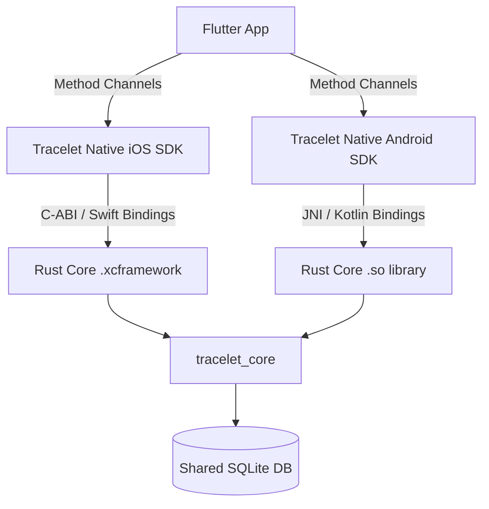

# Tracelet Rust Core Architecture

Tracelet v3.1.0 introduces a unified **Rust Core** (`tracelet_core`), fundamentally changing how the native SDKs operate. This document explains the architecture, why it was introduced, and how it is integrated into iOS and Android.

## 1. Why Rust?

Previously, complex geographic and cryptographic features were implemented twice:
- Swift for iOS
- Kotlin for Android

This led to subtle behavioral differences, double the maintenance effort, and diverging bugs. By consolidating the logic into a single Rust codebase, we achieve:
- **Write Once, Run Anywhere:** 100% mathematical and behavioral parity between platforms.
- **Performance:** Rust's zero-cost abstractions provide C++-level performance, crucial for high-frequency GPS processing and cryptographic hashing.
- **Memory Safety:** Rust's borrow checker prevents data races and segfaults, ensuring enterprise-grade stability.

## 2. Core Responsibilities

The Rust Core handles the "heavy lifting" for the SDKs. The native Swift and Kotlin layers are now primarily thin wrappers that handle OS-specific lifecycle events (like receiving GPS coordinates from CoreLocation/LocationManager) and pass them to Rust.

Currently, the Rust Core powers:

1. **Smart Geofencing (`geofence`)**
   - High-performance Haversine distance calculations.
   - Point-in-polygon ray-casting for complex geofences.
   - Evaluation of entry/exit triggers.

2. **Privacy Zones (`privacy`)**
   - Resolving overlapping privacy zones (Exclude vs. EventOnly vs. Degrade).
   - Coordinate degradation/snapping based on accuracy requirements.

3. **Enterprise Audit Trail (`audit`)**
   - Cryptographic hashing of location events.
   - Maintaining the tamper-proof SQLite chain.

4. **Shared Database Layer (`database`)**
   - Direct integration with `rusqlite` to store Geofences, Privacy Zones, and the Audit Trail, ensuring the exact same database schema across iOS and Android.

## 3. Architecture & Integration (UniFFI)

We use [Mozilla's UniFFI](https://mozilla.github.io/uniffi-rs/) to generate native bindings automatically.

### iOS Integration
- The Rust code is compiled into a multi-architecture XCFramework (`TraceletCore.xcframework`).
- UniFFI generates a Swift module exposing classes like `DatabaseManager` and `PrivacyZoneEvaluator`.
- The framework is bundled directly into the `tracelet_ios` Flutter plugin via CocoaPods (`vendored_frameworks`).

### Android Integration
- The Rust code is compiled into `.so` shared libraries for each Android architecture (arm64, armv7, x86_64).
- UniFFI generates Kotlin bindings (JNA/JNI).
- The libraries are packaged into the `tracelet-sdk` AAR, which is published to Maven Central.

## 4. Working with the Rust Core

If you need to add a new cross-platform feature:
1. Write the logic in `sdk/rust-core/src/`.
2. Expose the API via the `uniffi::export` macro or the `src/api.udl` file.
3. Re-run `flutter_rust_bridge_codegen generate` (if bridging to Dart directly) or the build scripts to regenerate the Swift/Kotlin bindings.

See the `sdk/rust-core/README.md` for specific build commands and dependency details.
